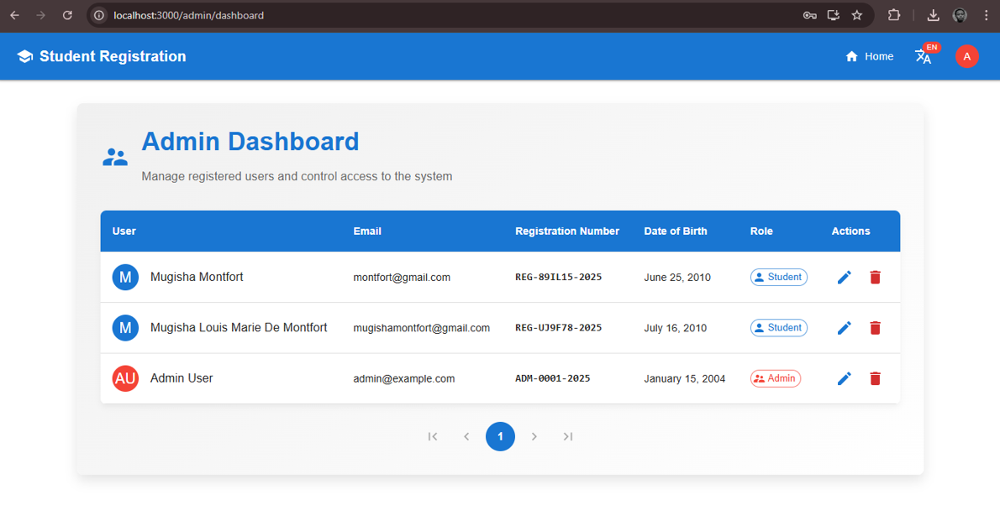
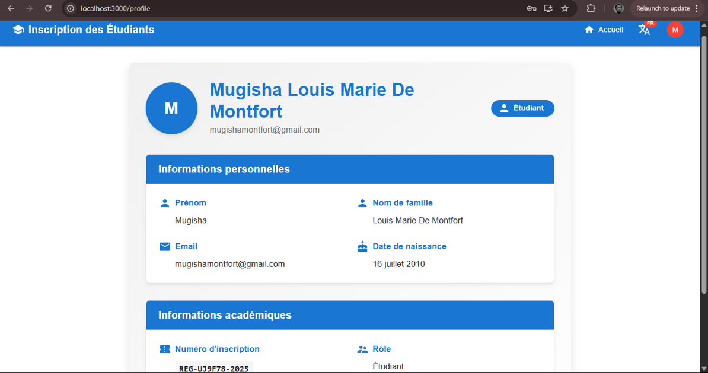
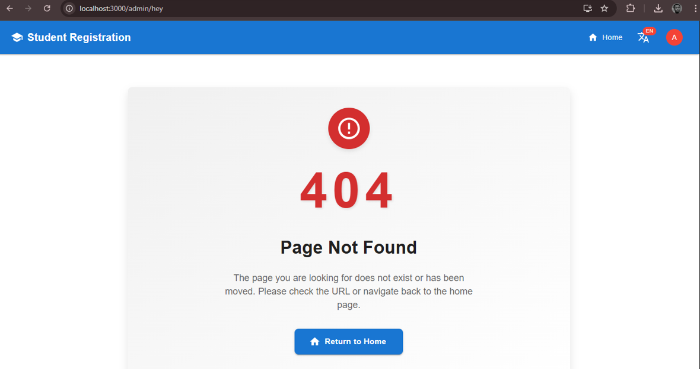

Frontend README - Student Registration System
Overview
This frontend application is built with React.js and Material-UI, providing a responsive interface for student registration, login, profile viewing, and an admin dashboard. It integrates seamlessly with the backend API.

Features
- Student registration with age validation
- Login for students and admins
- JWT token-based session handling
- Profile view with role-based display
- Admin dashboard for managing users
- Translator: English and French support
- 404 Not Found page
- Responsive design using Material-UI

Setup Instructions
1. Clone the repository:
   git clone https://github.com/Montfort28/student-registration-frontend.git
   cd student-registration-frontend
2. Install dependencies:
    npm install
3. Start the development server:
    npm start
4. The app runs on http://localhost:3000

Login Info (for testing)
Admin Login Credentials:
- Email: admin@example.com
- Password: admin123
Students can register themselves via the registration form.

Routing
- / : Home page
- /login : Login page
- /register : Registration page
- /profile : Protected profile page
- /admin/dashboard : Admin-only dashboard
- * : 404 Not Found page

Technologies Used
- React.js
- React Router DOM
- Material-UI
- Axios
- Custom translation context for multilingual support (English and French)

Bonus Features Implemented
- Dynamic language toggle (English/French)
- JWT authentication handled in AuthContext
- Persistent login on page refresh
- Responsive layout with Material-UI

### Admin Dashboard

### Profile Page in French

### 404 Page

